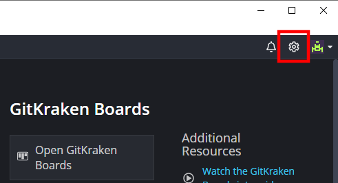
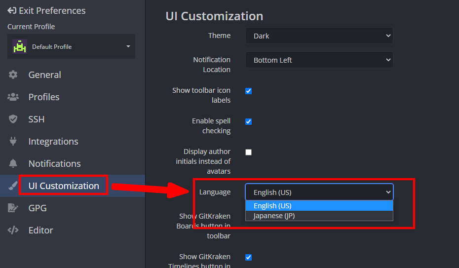

# gitkraken-i18n
Unofficial GitKraken i18n project  
GitKraken非公式日本語化プロジェクト

## Change Language

**言語の切り替えは自己責任でお願いします。言語の切り替えによって[不具合](https://github.com/megos/gitkraken-i18n/issues?q=is%3Aissue+is%3Aopen+label%3A%22known+issue%22)が発生することが報告されています。**

1. 切り替えたい言語の`strings.json`を以下の`strings.json`と置き換える
   - Windows: `%LOCALAPPDATA%\gitkraken\app-x.x.x\resources\app.asar.unpacked\src\strings.json`（x.x.xは任意のバージョン）
   - Mac: `/Applications/GitKraken.app/Contents/Resources/app.asar.unpacked/src/strings.json`
1. GitKrakenを再起動
1. 設定を開く  

1. "UI Customization" で言語を選択する 

## Translate

1. `strings.json`を`{locale}/strings.json`にコピー（`{locale}`は翻訳したい言語）
1. `{locale}/strings.json`を翻訳する
1. [Change Language](#Change%20Language) を元に言語を切り替えて翻訳を確かめる
